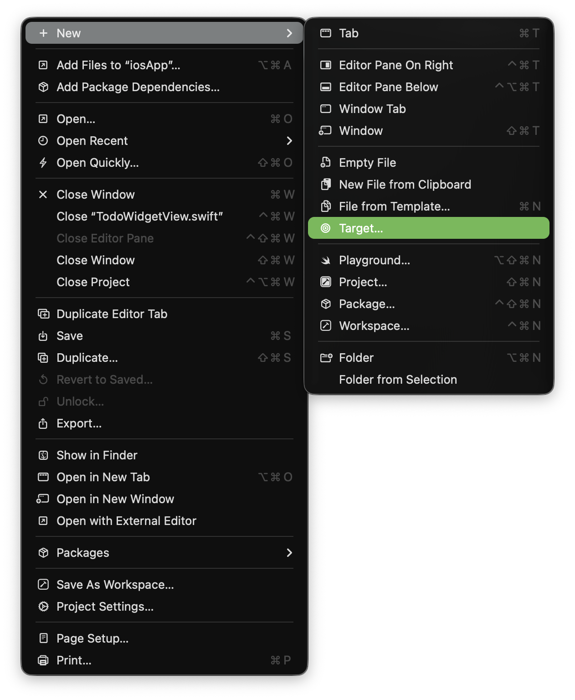
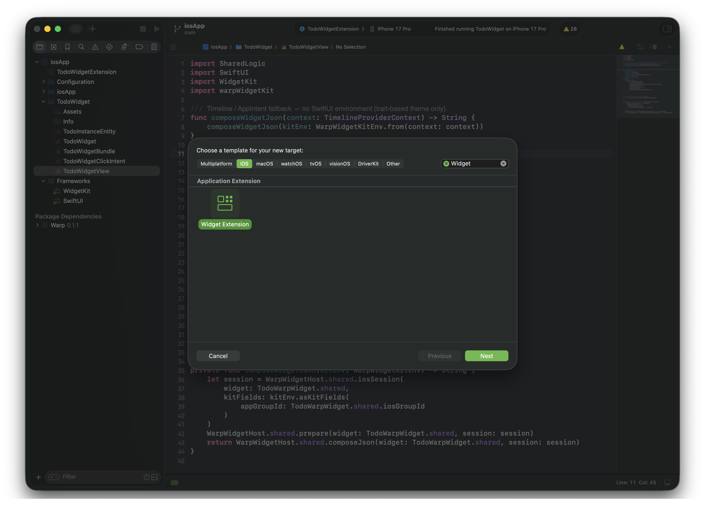
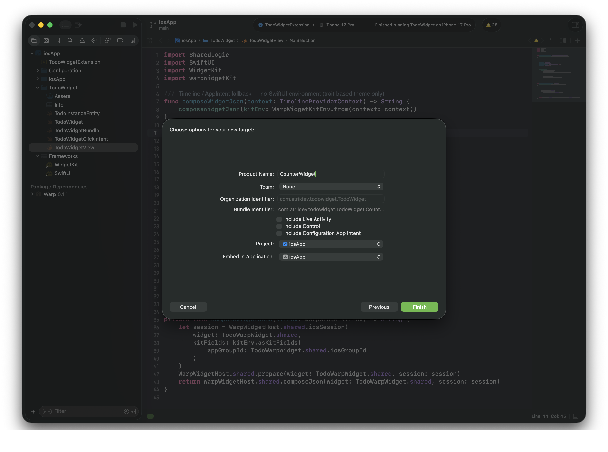
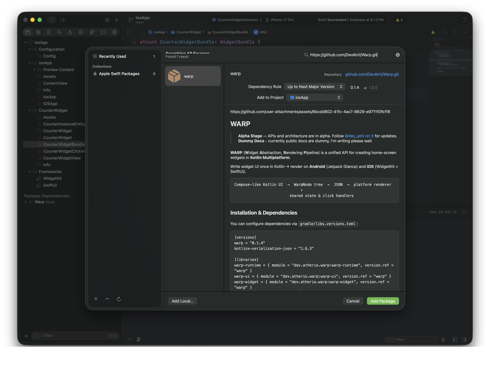
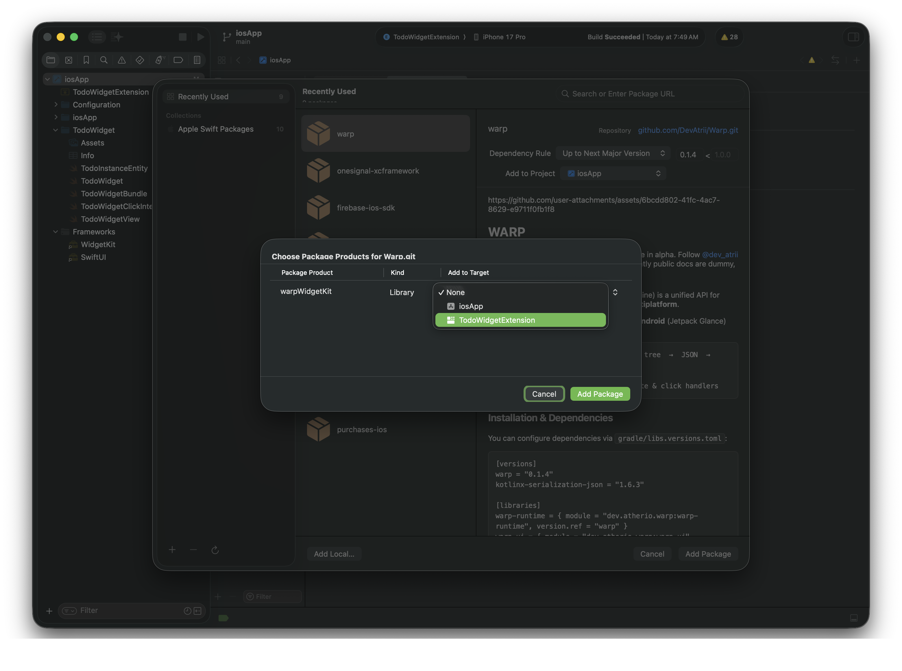
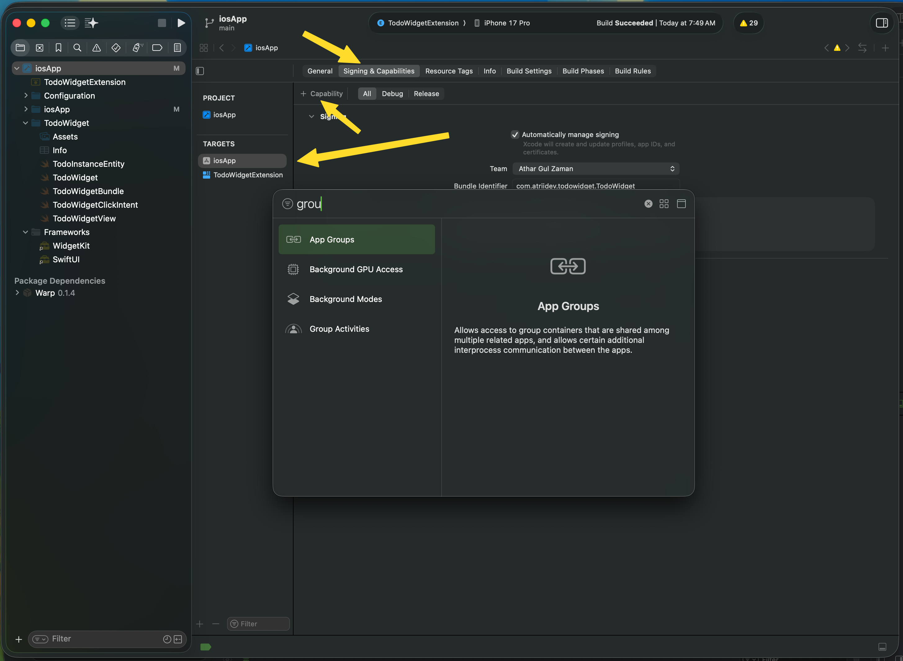
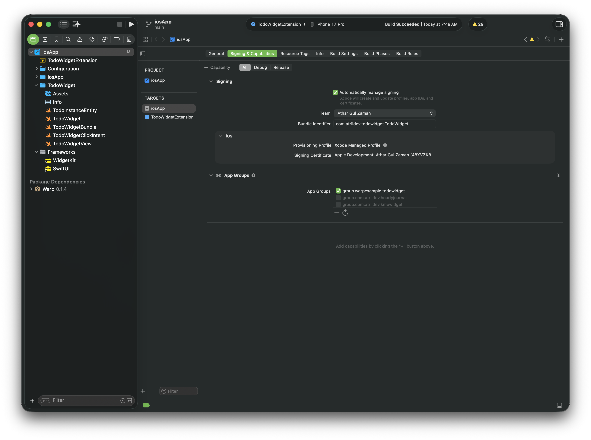
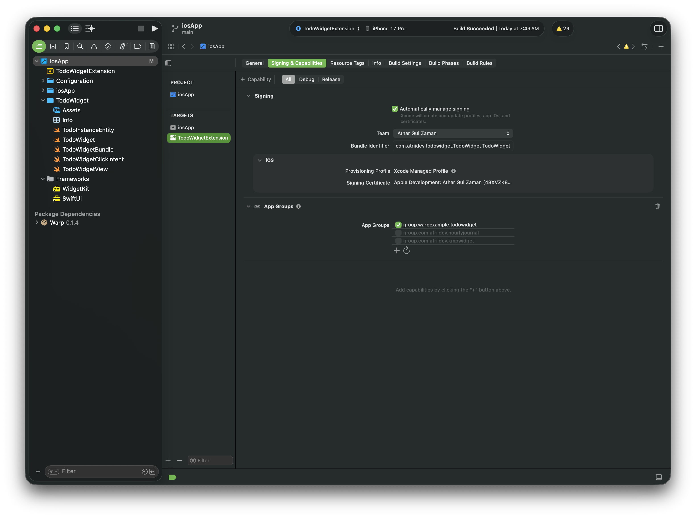
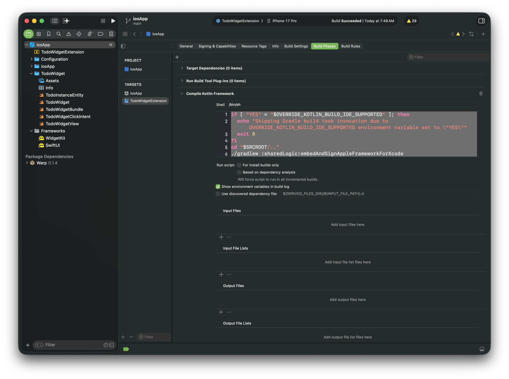

# Setup

Setting up **WARP** in your Kotlin Multiplatform project is straightforward. You only need to add the dependencies to your Version Catalog (`libs.versions.toml`), configure your shared `build.gradle.kts`, and set up your iOS Xcode Widget target.

---

## 1. Version Catalog

Add the WARP dependency, KotlinX Serialization, and Compose Runtime to your `gradle/libs.versions.toml`:

<p>
  
</p>

```toml title="gradle/libs.versions.toml"
[versions]
warp = "0.1.4"
kotlinx-serialization-json = "1.11.0"
compose-multiplatform = "1.11.1"

[libraries]
warp-widget = { group = "io.github.devatrii", name = "warp-widget", version.ref = "warp" }
kotlinx-serialization-json = { module = "org.jetbrains.kotlinx:kotlinx-serialization-json", version.ref = "kotlinx-serialization-json" }
compose-runtime = { module = "org.jetbrains.compose.runtime:runtime", version.ref = "compose-multiplatform" }

[plugins]
kotlin-serialization = { id = "org.jetbrains.kotlin.plugin.serialization", version.ref = "kotlin" }
composeCompiler = { id = "org.jetbrains.kotlin.plugin.compose", version.ref = "kotlin" }
```

---

## 2. Shared Module Gradle Configuration

In your shared module's `build.gradle.kts` (e.g., `shared/build.gradle.kts`), apply the serialization plugin, export `warp-widget` in iOS framework binaries, and declare dependencies in `commonMain`:

```kotlin title="shared/build.gradle.kts" hl_lines="3 13 25-27"
plugins {
    // ...
    alias(libs.plugins.kotlin.serialization)
}

kotlin {
    listOf(
        iosArm64(),
        iosSimulatorArm64()
    ).forEach { iosTarget ->
        iosTarget.binaries.framework {
            // ...
            export(libs.warp.widget)
        }
    }

    androidTarget { 
        // ...
    }

    sourceSets {
        // ...
        commonMain.dependencies {
            // Multiplatform dependencies
            api(libs.warp.widget)
            implementation(libs.kotlinx.serialization.json)
            implementation(libs.compose.runtime)
        }
    }
}
```

---

!!! note "App Size & KMP Business-Logic Compatibility"
    Notice that we are **only including `compose.runtime`** here. It does **not** pull in Compose Multiplatform UI (`compose.ui`, graphics, or rendering pipelines), meaning it **will not increase your app size**. 
    
    This allows WARP to seamlessly work even in pure Kotlin Multiplatform (KMP) projects that only share business logic without full Compose Multiplatform UI.

    📊 For an app size benchmark and detailed impact breakdown, check the [Todo Widget Benchmark Example](https://github.com/DevAtrii/Warp/tree/main/examples/todo-widget#ios-build-size-report).

---

## 3. iOS Target Setup

To render your widgets on iOS using Swift & WidgetKit, follow these Xcode setup steps:

### Step 3.1 – Create Widget Extension Target
1. Open your project in **Xcode**.
2. Select **File > New > Target...**.
3. Choose **Widget Extension**, enter a name for your target (e.g., `AppWidget`), and finish creation.





---

### Step 3.2 – Add Swift Package Dependency (`warpWidgetKit`)
1. Go to **File > Add Package Dependencies...** in Xcode.
2. Enter the repository URL: `https://github.com/DevAtrii/Warp.git`
3. Select the latest version and add the `warpWidgetKit` package product to your **Widget Extension Target**.




---

### Step 3.3 – Configure App Group Capability
1. Select your project root in **Xcode**.
2. Under **Signing & Capabilities**, add the **App Groups** capability to **both** your **Main App Target** and **Widget Extension Target**.
3. Ensure both targets use the exact same App Group ID (e.g., `group.com.yourcompany.yourapp`).





!!! warning "Important"
    Add same App Group to both Main App Target and Widget Extension Target.

---

### Step 3.4 – Add Compile Kotlin Build Phase
Add a **Run Script** build phase in Xcode so that your Kotlin Multiplatform framework compiles automatically when building your Widget Extension:

1. Select your **Widget Extension Target** > **Build Phases**.
2. Click **+** > **New Run Script Phase**.
3. Drag to move this phase above **Compile Sources**.
4. Add the Kotlin framework compilation script:

```bash title="Xcode Build Phase Script"
if [ "YES" = "$OVERRIDE_KOTLIN_BUILD_IDE_SUPPORTED" ]; then
  echo "Skipping Gradle build task invocation due to OVERRIDE_KOTLIN_BUILD_IDE_SUPPORTED environment variable set to \"YES\""
  exit 0
fi
cd "$SRCROOT/.."
./gradlew :sharedLogic:embedAndSignAppleFrameworkForXcode
```
!!! note "Tip"
    You can also copy this from iosApp build phase to match your project specific setup.

