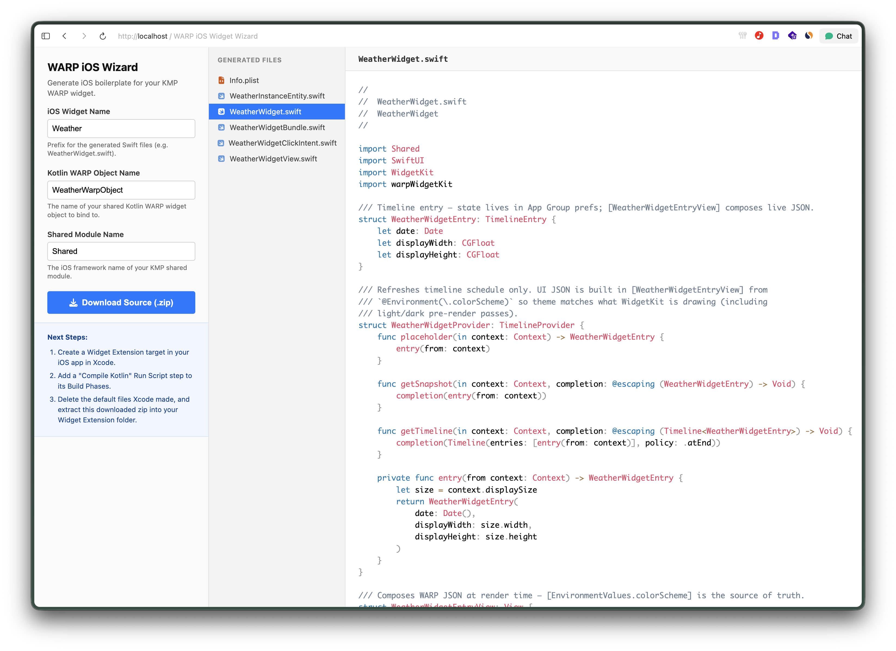

# Creating Your First Widget

This guide walks you step-by-step through creating a simple, interactive Counter Widget with **WARP** containing a count label and **+** / **−** buttons.

---

## Architecture Overview

Building a WARP widget consists of three main phases:

```
┌────────────────────────────────────────────────────────┐
│                   1. Shared Widget                     │
│      Defined in commonMain (State, Actions, UI)        │
└───────────────────────────┬────────────────────────────┘
                            │
            ┌───────────────┴───────────────┐
            ▼                               ▼
┌───────────────────────┐       ┌───────────────────────┐
│   2. Android Host     │       │     3. iOS Host       │
│  WarpGlanceWidget &   │       │  WidgetKit & Swift    │
│  WarpGlanceReceiver   │       │  via Widget Wizard    │
└───────────────────────┘       └───────────────────────┘
```

---

## Step 1: Define Shared Widget in `commonMain`

Create `CounterWarpWidget.kt` inside your shared module's `commonMain` source set.

### 1.1 State & Actions
Define serializable models for your state and user interactions:

```kotlin title="CounterWarpWidget.kt"
package com.atriidev.kmpwidget

import kotlinx.serialization.Serializable

/** 1. Widget State */
@Serializable
data class CounterState(
    val count: Int = 0,
)

/** 2. Type-Safe User Actions */
@Serializable
sealed class CounterActions {
    @Serializable data object Increment : CounterActions()
    @Serializable data object Decrement : CounterActions()
    @Serializable data object Reset : CounterActions()
}
```

---

### 1.2 Action Handler
Handle user button taps and update persistent widget state:

```kotlin title="CounterWarpWidget.kt"
class CounterWarpActionHandler(
    private val session: WarpWidgetSession,
) : WarpActionHandler<CounterActions>(CounterActions.serializer()) {

    override suspend fun onAction(action: CounterActions) {
        updateWarpWidgetState(session, CounterWarpWidget) { state ->
            when (action) {
                CounterActions.Increment -> state.copy(count = state.count + 1)
                CounterActions.Decrement -> state.copy(count = state.count - 1)
                CounterActions.Reset -> state.copy(count = 0)
            }
        }
    }
}
```

---

### 1.3 Asset Keys & Resource Management Best Practices

Define cross-platform asset identifiers for icons used in your UI:

```kotlin title="CounterWarpWidget.kt"
/** Asset IDs mapped to platform resources */
object CounterAssets {
    val Plus = WarpAssetId("plus")
    val Minus = WarpAssetId("minus")
}
```

!!! tip "Resource Management Best Practice"
    * On **iOS**, `WarpAssetId("plus")` automatically maps to native **SF Symbols** (`systemName: "plus"`).
    * On **Android**, you map each `WarpAssetId` to native Android `R.drawable` resources inside your `WarpGlanceWidget`.

!!! note "Resource Support Note"
    Currently, WARP supports **drawable resources** for icons and images. Support for localized **string resources** is planned for an upcoming release.

---

### 1.4 Complete `WarpWidget` Definition

Implement `WarpWidget<CounterState>` and compose your UI using WARP primitives:

!!! warning "Important ID & Group Configuration"
    * **`id` (`override val id: String = "CounterWidget"`)**: Must strictly match the **iOS Widget `kind` identifier** specified in your Swift Widget Extension target (e.g. `"CounterWidget"`).
    * **`iosGroupId` (`override val iosGroupId: String = "group.com.example.app"`)**: Crucial for iOS state persistence across your main app and widget extension. See the [Setup Guide](1-setup.md#3-ios-target-setup) to configure your App Group ID.

```kotlin title="CounterWarpWidget.kt"
object CounterWarpWidget : WarpWidget<CounterState>(CounterState.serializer()) {
    override val id: String = "CounterWidget"
    override val iosGroupId: String = "group.com.example.app"
    override val stateScope: WarpWidgetStateScope = WarpWidgetStateScope.Shared

    override suspend fun defaultState(): CounterState = CounterState()

    @Composable
    override fun Content(env: WidgetEnvironment, state: CounterState) {
        WarpTheme(environment = env) {
            WarpBox(
                modifier = WarpModifier
                    .fillMaxSize()
                    .background(WarpTheme.colors.widgetBackground)
                    .padding(16.dp),
                contentAlignment = WarpContentAlignment.Center,
            ) {
                WarpRow(
                    modifier = WarpModifier.fillMaxWidth(),
                    verticalAlignment = WarpVerticalAlignment.Center,
                ) {
                    WarpButton(
                        text = "−",
                        onClick = CounterActions.Decrement.asClickAction(),
                        modifier = WarpModifier.size(40.dp),
                        colors = WarpButtonColors(
                            backgroundColor = WarpColor.Red,
                            contentColor = WarpColor.White,
                        ),
                    )
                    WarpText(
                        text = "${state.count}",
                        modifier = WarpModifier
                            .weight()
                            .clickable(CounterActions.Reset.asClickAction()),
                        style = WarpTextStyle(
                            fontSize = 24.sp,
                            fontWeight = WarpFontWeight.Bold,
                            color = WarpTheme.colors.onSurface,
                        ),
                    )
                    WarpButton(
                        text = "+",
                        onClick = CounterActions.Increment.asClickAction(),
                        modifier = WarpModifier.size(40.dp),
                        colors = WarpButtonColors(
                            backgroundColor = WarpColor.Green,
                            contentColor = WarpColor.White,
                        ),
                    )

                }
            }
        }
    }

    override fun clickHandlers(session: WarpWidgetSession): List<WarpActionHandler<*>> =
        listOf(CounterWarpActionHandler(session))
}
```

!!! note "Understanding `stateScope`"
    WARP provides two options for managing widget state scoping:

    * `WarpWidgetStateScope.Shared`: Every widget instance across both Android and iOS shares the exact same state. Updating the state in one widget updates all instances.
    * `WarpWidgetStateScope.Instance`: 
        * **Android**: Every widget instance added to the home screen has its own unique, isolated state.
        * **iOS**: WidgetKit scopes state per **widget family** (e.g., `systemSmall`, `systemMedium`, `systemLarge`). This means two `small` widgets will share the same state, while a `medium` widget will have its own separate state.

!!! note "Understanding `WarpAsset` Image Types"
    When displaying images using `WarpImage`, you can wrap your `WarpAssetId` using one of the following `WarpAsset` variants:

    * `.asSystem()` / `WarpAsset.System`: Resolves to native **SF Symbols** on iOS, and mapped `R.drawable` keys on Android.
    * `.asId()` / `WarpAsset.Id`: Resolves to app-bundled assets (iOS Asset Catalog / Android drawable registry).
    * `WarpAssets.Android.Uri("file://...")`: Resolves local file or content URIs (remote `http/https` URLs are not supported due to OS widget resource limits).

---


## Step 2: Connect Android Host (`androidMain`)

On Android, WARP uses **Jetpack Glance** under the hood. Instead of writing raw Glance receivers, WARP provides `WarpGlanceWidgetReceiver` and `WarpGlanceWidget`.

### 2.1 Create Receiver & Widget (`CounterWidgetGlance.kt`)

Create `shared/androidMain/.../CounterWidgetGlance.kt`:

```kotlin title="CounterWidgetGlance.kt"
package com.atriidev.kmpwidget

import com.atriidev.kmpwidget.shared.R
import com.atriidev.warp_ui.glance.WarpDrawableAsset
import com.atriidev.warp_widget.WarpGlanceWidget
import com.atriidev.warp_widget.WarpGlanceWidgetReceiver
import com.atriidev.warp_widget.WarpWidgetHostApi

/** 1. Broadcast Receiver for Glance */
class CounterWidgetReceiver : WarpGlanceWidgetReceiver() {
    override fun createGlanceWidget() = CounterGlanceAppWidget(createWarpWidget())
    override fun createWarpWidget(): WarpWidgetHostApi = CounterWarpWidget
}

/** 2. Glance App Widget Host */
class CounterGlanceAppWidget(
    private val widget: WarpWidgetHostApi,
) : WarpGlanceWidget() {
    override fun createWarpWidget(): WarpWidgetHostApi = widget

    // Map WARP Asset IDs to Android Drawable Resources
    override fun assets(): List<WarpDrawableAsset> = listOf(
        WarpDrawableAsset(CounterAssets.Plus, R.drawable.ic_plus),
        WarpDrawableAsset(CounterAssets.Minus, R.drawable.ic_minus),
    )
}
```

---

### 2.2 Create App Widget Info XML Metadata

Tell the Android OS about your widget configuration by creating `my_app_widget_info.xml` inside `shared/src/androidMain/res/xml/`. Set `minWidth` and `minHeight` to `158dp` (2x2 grid cells) to align with iOS small widget dimensions:

```xml title="shared/src/androidMain/res/xml/my_app_widget_info.xml"
<appwidget-provider xmlns:android="http://schemas.android.com/apk/res/android"
    android:initialLayout="@layout/glance_default_loading_layout"
    android:minWidth="158dp"
    android:minHeight="158dp"
    android:minResizeWidth="158dp"
    android:minResizeHeight="158dp"
    android:targetCellWidth="2"
    android:targetCellHeight="2" 
    android:resizeMode="horizontal|vertical"
    android:widgetCategory="home_screen" />
```


---

### 2.3 Register Receiver in AndroidManifest.xml

Register `CounterWidgetReceiver` inside `shared/src/androidMain/AndroidManifest.xml` (or your main Android app module's manifest):

```xml title="shared/src/androidMain/AndroidManifest.xml"
<manifest xmlns:android="http://schemas.android.com/apk/res/android">

    <application>
        <receiver
            android:name="com.atriidev.kmpwidget.CounterWidgetReceiver"
            android:exported="true">
            <intent-filter>
                <action android:name="android.appwidget.action.APPWIDGET_UPDATE" />
                <action android:name="android.intent.action.CONFIGURATION_CHANGED" />
                <action android:name="android.intent.action.UI_MODE_CHANGED" />
            </intent-filter>
            <meta-data
                android:name="android.appwidget.provider"
                android:resource="@xml/my_app_widget_info" />
        </receiver>
    </application>

</manifest>
```

---

## Step 3: Connect iOS Host (`iosApp`)

Setting up Swift WidgetKit extensions manually can be verbose because iOS requires defining custom `WidgetBundle`, `AppIntent`, `TimelineProvider`, and `WidgetView` structures for each widget.

To simplify this, use the interactive **[Warp Widget Wizard](../wizard.html)** web generator!



---

### Form Fields Explanation

When configuring the **[Warp Widget Wizard](../wizard.html)**, specify the following parameters:

| Form Field | Description | Example |
| :--- | :--- | :--- |
| **iOS Widget Name** | Prefix for all generated Swift files, structs, and intent handlers. | `Counter` or `Weather` |
| **Kotlin WARP Object Name** | The exact name of your shared Kotlin `object` extending `WarpWidget` defined in `commonMain`. | `CounterWarpWidget` |
| **Shared Module Name** | The iOS framework name (`baseName`) of your KMP shared Gradle module. | `Shared` or `SharedLogic` |

#### Detailed Field Roles:
- **`iOS Widget Name`** (e.g. `Counter`): Controls the file naming scheme (e.g., `CounterWidget.swift`, `CounterWidgetBundle.swift`, `CounterWidgetClickIntent.swift`).
- **`Kotlin WARP Object Name`** (e.g. `CounterWarpWidget`): Binds your Swift Widget extension directly to the shared Kotlin object via `CounterWarpWidget.shared`.
- **`Shared Module Name`** (e.g. `Shared` or `SharedLogic`): Configures the Swift `import` statement for your compiled Kotlin Multiplatform framework (matching `framework { baseName = "Shared" }` in `build.gradle.kts`).

---

### Generated Swift Files Breakdown

Clicking **Download Source (.zip)** produces a ready-to-use archive containing 6 generated files:

1. **`{Name}InstanceEntity.swift`**: Defines an `AppEntity` identifier for per-widget instance scoping.
2. **`{Name}Widget.swift`**: Sets up WidgetKit's `StaticConfiguration`, `TimelineProvider`, and main entry view.
3. **`{Name}WidgetBundle.swift`**: The `@main` extension entry point initializing `WarpWidgetHost` and registering click intent handlers.
4. **`{Name}WidgetClickIntent.swift`**: Interactive Swift `AppIntent` handler (iOS 17+) that dispatches tap actions back to Kotlin.
5. **`{Name}WidgetView.swift`**: Live renderer converting WARP UI JSON instructions into native SwiftUI elements.
6. **`Info.plist`**: Extension configuration declaring `com.apple.widgetkit-extension`.

---

### Quick iOS Integration Steps:

1. Ensure you have completed the Xcode target setup in the [Setup Guide](1-setup.md#3-ios-target-setup).
2. Open the **[Warp Widget Wizard](../wizard.html)**.
3. Fill in your **iOS Widget Name**, **Kotlin WARP Object Name**, and **Shared Module Name**.
4. Click **Download Source (.zip)**.
5. Extract the `.zip` archive into your Xcode Widget Extension folder.

---

## Managing & Updating Widget State from Main App

Besides interactive button tap handlers inside the widget UI, your main application (Android App, iOS App, ViewModels, or Background Workers) can read and update widget state programmatically.

### 1. Updating All Installed Widget Instances

When updating state across all home screen instances (for example, after syncing network data or completing a background task):

```kotlin title="Updating All Widget Instances"
import com.atriidev.warp_widget.api.PlatformContext
import com.atriidev.warp_widget.listWarpWidgetIds
import com.atriidev.warp_widget.updateWarpWidgetState

suspend fun updateAllCounterWidgetInstances(
    context: PlatformContext,
    transform: (CounterState) -> CounterState,
) {
    listWarpWidgetIds(context, CounterWarpWidget).forEach { id ->
        updateWarpWidgetState(context, CounterWarpWidget, id, transform)
    }
}
```

---

### 2. Updating Single or Shared Instance State

If your widget uses `WarpWidgetStateScope.Shared`, or when targeting the primary widget instance directly:

```kotlin title="Updating Primary Instance"
import com.atriidev.warp_widget.api.PlatformContext
import com.atriidev.warp_widget.updateWarpWidgetState

suspend fun updateCounterWidget(
    context: PlatformContext,
    newCount: Int,
) {
    updateWarpWidgetState(context, CounterWarpWidget) { state ->
        state.copy(count = newCount)
    }
}
```

---

### 3. Reading Widget State from Host App

To inspect the currently saved state of an installed widget instance from your main application (or fall back to `defaultState()` if no widget has been added yet):

```kotlin title="Reading State from Host App"
import com.atriidev.warp_widget.api.PlatformContext
import com.atriidev.warp_widget.listWarpWidgetIds
import com.atriidev.warp_widget.readWarpWidgetState

suspend fun readCounterWidgetState(context: PlatformContext): CounterState {
    val ids = listWarpWidgetIds(context, CounterWarpWidget)
    if (ids.isEmpty()) return CounterWarpWidget.defaultState()
    return readWarpWidgetState(context, CounterWarpWidget, ids.first())
}
```

!!! note "Obtaining `PlatformContext` across Platforms"
    * **Compose UI (`commonMain`)**: In Compose UI screens or composables, obtain `PlatformContext` using `rememberPlatformContext`:
      ```kotlin
      val platformContext = rememberPlatformContext(widget = CounterWarpWidget)
      ```
    * **Android (`androidMain`)**: `PlatformContext` resolves to your Android `android.content.Context` (or application context).
    * **iOS (`iosMain` or Swift)**: Obtain `PlatformContext` using `getPlatformContext` passing your WARP widget instance:
      ```kotlin
      // Inside iosMain (Kotlin):
      val platformContext = getPlatformContext(widget = CounterWarpWidget)
      ```
      ```swift
      // Inside Swift code:
      let platformContext = getPlatformContext(widget: CounterWarpWidget.shared)
      ```

---

!!! tip "IDE Plugin Roadmap & Project Support ☕️"
    We know writing iOS Swift boilerplate manually can feel repetitive. That's why we created the **Widget Wizard** generator. 
    
    An official **Xcode / Android Studio Plugin** is currently planned to automate iOS widget boilerplate generation directly inside your IDE!
    
    If you find WARP helpful, consider supporting the project to accelerate plugin development:

    <div style="display: flex; gap: 10px; margin-top: 10px;">
      <a href="https://buymeacoffee.com/devatrii" target="_blank">
        
      </a>
      <a href="https://www.youtube.com/@devatrii" target="_blank">
        
      </a>
    </div>

